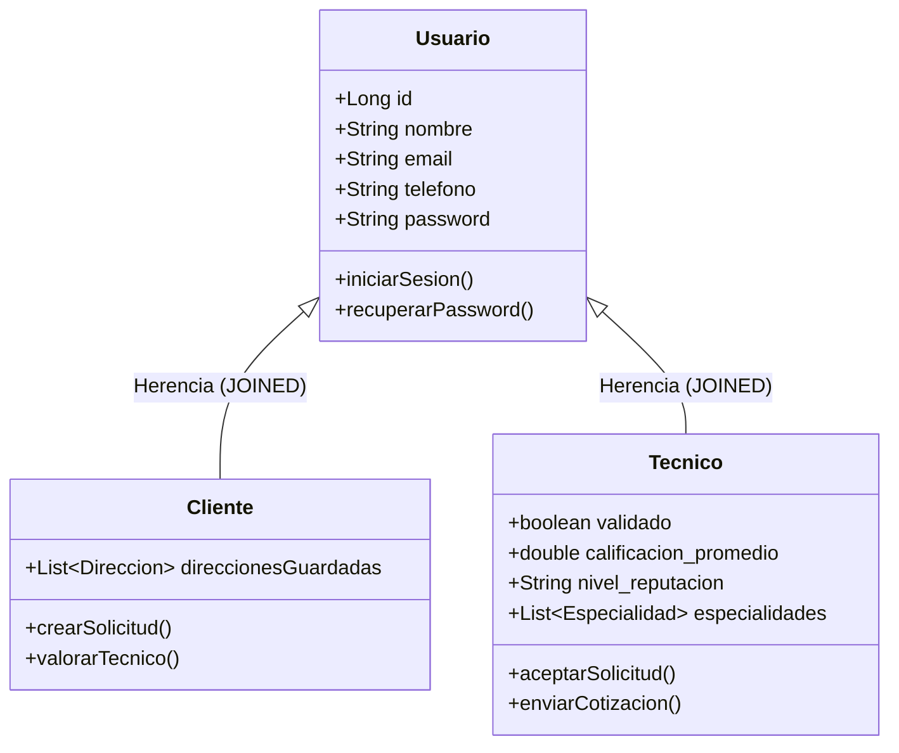
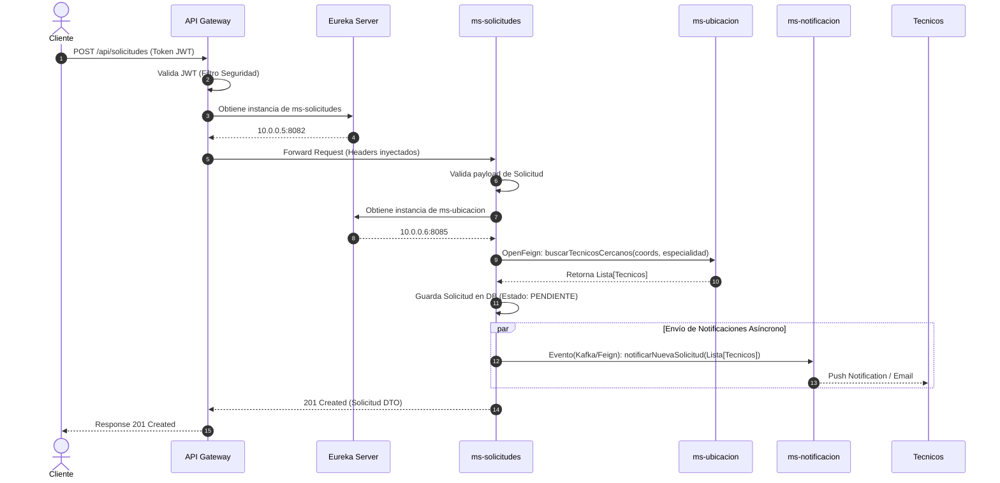

# 🛠️ HomeFixer Backend Ecosystem


HomeFixer es una plataforma integral diseñada bajo una **arquitectura de microservicios cloud-native** que conecta a clientes que necesitan reparaciones u obras en el hogar con técnicos especializados. 

Este repositorio contiene todo el ecosistema backend, diseñado para ser altamente escalable, resiliente, modular y seguro.

---

## 🚀 Tecnologías Principales

- **Lenguaje:** Java 17
- **Framework Core:** Spring Boot 3.2.x
- **Cloud & Discovery:** Spring Cloud 2023.0.x (Netflix Eureka, Spring Cloud Gateway, OpenFeign)
- **Persistencia:** Spring Data JPA / Hibernate
- **Base de Datos:** PostgreSQL / MySQL (Soporte multibase según configuración)
- **Seguridad:** JWT (JSON Web Tokens) en API Gateway y soporte preparado para Azure AD (MSAL)
- **Documentación API:** SpringDoc OpenAPI 3 (Swagger UI)
- **Herramientas Adicionales:** Lombok, Maven (Multi-módulo)

---

## 🏗 Arquitectura del Sistema (UML)

El sistema utiliza un **API Gateway** como único punto de entrada para los clientes web/móviles. El Gateway se encarga del enrutamiento dinámico y la validación de seguridad (CORS y JWT). 
Todos los microservicios se registran dinámicamente en el **Servidor Eureka**, lo que permite:
- Balanceo de carga interno en el lado del cliente (Ribbon/LoadBalancer).
- Resolución de nombres transparente mediante **OpenFeign**.

### Diagrama de Arquitectura de Contenedores (C4 / Despliegue)

```mermaid
graph TD
    %% Define styles
    classDef client fill:#1f77b4,stroke:#fff,stroke-width:2px,color:#fff,rx:5px;
    classDef gateway fill:#ff7f0e,stroke:#fff,stroke-width:2px,color:#fff,rx:5px;
    classDef discovery fill:#2ca02c,stroke:#fff,stroke-width:2px,color:#fff,rx:5px;
    classDef ms fill:#9467bd,stroke:#fff,stroke-width:2px,color:#fff,rx:5px;
    classDef db fill:#d62728,stroke:#fff,stroke-width:2px,color:#fff,rx:15px;

    %% Nodes
    ClientWeb(Cliente Web App) :::client
    ClientMovil(Cliente App Móvil) :::client

    APIGateway(API Gateway\n:8080\nFiltros, JWT, Rutas) :::gateway
    EurekaServer(Eureka Discovery Server\n:8761) :::discovery
    
    MSAuth(ms-autenticacion\n:8083) :::ms
    MSUser(ms-usuarios\n:8081) :::ms
    MSSolicitudes(ms-solicitudes\n:8082) :::ms
    MSUbicacion(ms-ubicacion\n:8085) :::ms
    MSPagos(ms-pagos\n:8087) :::ms
    MSValoraciones(ms-valoraciones\n:8088) :::ms
    MSMaestria(ms-maestria\n:8084) :::ms
    MSNotificacion(ms-notificacion\n:8086) :::ms
    
    DBUser[(DB Usuarios)] :::db
    DBSolicitudes[(DB Solicitudes)] :::db
    DBPagos[(DB Pagos)] :::db
    DBValoraciones[(DB Valoraciones)] :::db

    %% Connections
    ClientWeb -->|REST / HTTPS| APIGateway
    ClientMovil -->|REST / HTTPS| APIGateway

    APIGateway -->|Ruteo y Load Balancing| MSAuth
    APIGateway -->|Ruteo y Load Balancing| MSUser
    APIGateway -->|Ruteo y Load Balancing| MSSolicitudes
    APIGateway -->|Ruteo y Load Balancing| MSUbicacion
    APIGateway -->|Ruteo y Load Balancing| MSPagos
    APIGateway -->|Ruteo y Load Balancing| MSValoraciones
    
    %% Eureka Registrations
    APIGateway -.->|Registra/Descubre| EurekaServer
    MSAuth -.->|Registra| EurekaServer
    MSUser -.->|Registra| EurekaServer
    MSSolicitudes -.->|Registra| EurekaServer
    MSUbicacion -.->|Registra| EurekaServer
    MSPagos -.->|Registra| EurekaServer
    MSValoraciones -.->|Registra| EurekaServer
    MSMaestria -.->|Registra| EurekaServer
    MSNotificacion -.->|Registra| EurekaServer

    %% Internal Communication (OpenFeign)
    MSUser -->|OpenFeign| MSValoraciones
    MSSolicitudes -->|OpenFeign| MSUser
    MSSolicitudes -->|OpenFeign| MSUbicacion
    MSPagos -->|OpenFeign| MSSolicitudes
    
    %% DB Connections
    MSUser --> DBUser
    MSSolicitudes --> DBSolicitudes
    MSPagos --> DBPagos
    MSValoraciones --> DBValoraciones
```

---

## 📦 Módulos y Microservicios

| Módulo / Microservicio | Puerto | Descripción | Persistencia |
| ---------------------- | :----: | ----------- | :-----------: |
| **`eureka-server`** | `8761` | Servidor de descubrimiento de servicios (Service Registry). | No |
| **`api-gateway`** | `8080` | Punto de entrada único. Maneja ruteo, filtros globales, CORS y validación de tokens JWT. | No |
| **`ms-usuarios`** | `8081` | Gestión de perfiles, modelo de herencia (Usuarios, Clientes, Técnicos), reputación y estados. | Sí |
| **`ms-solicitudes`** | `8082` | Core de negocio: Gestión de solicitudes de servicio, estados, cotizaciones y asignaciones. | Sí |
| **`ms-autenticacion`**| `8083` | Identity Provider interno. Generación y validación de JWT, login, registro. | No |
| **`ms-maestria`** | `8084` | Especialidades, certificaciones e insignias para validar las habilidades de los técnicos. | Sí |
| **`ms-ubicacion`** | `8085` | Lógica geoespacial, cálculo de distancias y algoritmos de proximidad de técnicos. | No |
| **`ms-notificacion`** | `8086` | Servicio asíncrono para el envío de alertas (WebSockets, Emails, SMS). | No |
| **`ms-pagos`** | `8087` | Procesamiento de transacciones, integración con pasarelas, generación de recibos. | Sí |
| **`ms-valoraciones`** | `8088` | Gestión de reseñas, comentarios y actualización del rating de técnicos y clientes. | Sí |
| **`ms-promociones`** | `8089` | Motor de descuentos, cupones y membresías premium para técnicos. | Sí |
| **`ms-reportes`** | `8090` | Consolidación de métricas, analíticas del sistema y tableros administrativos. | No |
| **`shared`** | `N/A` | Módulo común empaquetado como dependencia (Librería). Contiene DTOs compartidos, Enums globales y utilidades. | No |

---

## 📊 Diagramas UML de Dominio e Interacción

### 1. Diagrama de Entidad Relación (Módulo Usuarios)
El sistema utiliza una estrategia de persistencia de herencia (Ej. `JOINED`) para los usuarios de la plataforma, optimizando la base de datos para distinguir roles y responsabilidades.



### 2. Diagrama de Secuencia (Flujo: Cliente Solicita Servicio)
Este diagrama muestra cómo interactúan los distintos microservicios, el Gateway y Eureka cuando un usuario crea una solicitud de servicio.



---

## 🔒 Seguridad y Configuración

El proyecto está diseñado bajo los principios de los **12-Factor Apps** y está listo para entornos Cloud. **No existen credenciales sensibles hardcodeadas en el código fuente**. Todo se maneja mediante variables de entorno o archivos `.env`.

### Variables Globales Recomendadas
- `SPRING_DATASOURCE_URL`: (Ej: `jdbc:mysql://localhost:3306/homefixer_bd?useSSL=false`)
- `SPRING_DATASOURCE_USERNAME`: Usuario de la BD.
- `SPRING_DATASOURCE_PASSWORD`: Contraseña de la BD.
- `JWT_SECRET`: Llave secreta encriptada (HMAC-SHA256) usada para firmar y validar tokens en el Gateway y Auth.
- `AZURE_CLIENT_ID` y `AZURE_TENANT_ID`: (Opcional) Si se utiliza integración MSAL / Azure AD.

*(Por defecto, para desarrollo local, si no se definen variables, el sistema usará `localhost:3306` con credenciales genéricas para la base de datos).*

---

## 📖 Documentación de APIs (Swagger / OpenAPI 3)

El sistema utiliza **SpringDoc OpenAPI 3** configurado transversalmente para documentar todos los endpoints expuestos de manera automática.

Para acceder a la consola interactiva local (Swagger UI) de cualquier microservicio en ejecución, navegue a:
`http://localhost:<PUERTO>/swagger-ui/index.html`

Por ejemplo:
- **ms-usuarios:** [http://localhost:8081/swagger-ui/index.html](http://localhost:8081/swagger-ui/index.html)
- **ms-solicitudes:** [http://localhost:8082/swagger-ui/index.html](http://localhost:8082/swagger-ui/index.html)

---

## 🛠️ Cómo Ejecutar el Proyecto (Desarrollo Local)

Debido a la naturaleza distribuida de la plataforma, el orden de inicio es importante. Puedes usar los scripts proporcionados (`start-all.bat` o `start-all.ps1`), o seguir los pasos manualmente:

1. **Infraestructura Base:** Asegúrate de tener tu motor de base de datos MySQL/PostgreSQL ejecutándose en el puerto por defecto.
2. **Construir el Proyecto Multimódulo:**
   En la raíz del proyecto, instala todos los módulos. Esto compilará el módulo `shared` y lo hará disponible.
   ```bash
   mvn clean install -DskipTests
   ```
3. **Paso 1: Iniciar el Service Registry:**
   Inicia `eureka-server` (Puerto `8761`). Espera a que el panel web de Eureka esté disponible en `http://localhost:8761`.
4. **Paso 2: Iniciar el Gateway:**
   Inicia `api-gateway` (Puerto `8080`). Este microservicio ya empezará a buscar a Eureka para registrarse.
5. **Paso 3: Iniciar Microservicios Core:**
   Levanta los demás servicios de negocio según necesites probar (ej: `ms-usuarios`, `ms-solicitudes`). Se registrarán en Eureka de forma automática tras unos instantes.

---

## 🤝 Contribución y Patrones de Diseño

- **DTO Pattern:** Todas las respuestas de la API utilizan Data Transfer Objects en lugar de exponer entidades JPA directamente.
- **Service Layer Pattern:** Lógica de negocio separada en la capa `@Service`.
- **Global Exception Handling:** Manejador de excepciones transversal con `@ControllerAdvice` para devolver siempre el mismo formato de error estándar a través del Gateway.
- **Feign Clients:** La comunicación interna (Síncrona) debe hacerse mediante interfaces `@FeignClient` definidas de preferencia en el módulo donde se invocan, evitando acoplamiento.

---
*Desarrollado para la Plataforma HomeFixer.*
